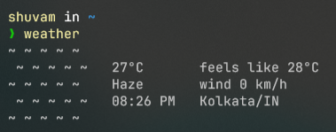

# Tenki 天気

Tenki is a command-line tool for visualizing weather conditions. The name "Tenki" comes from the Japanese word for "weather".



### Getting Started

1. **Clone the Repository**   
   ```sh
   git clone https://github.com/shuvam586/tenki.git
   ```  

2. **Install Dependencies**
   ```sh
   pip install -r requirements.txt
   ``` 

3. **API Key**  
   Generate an API key from [OpenWeather](https://openweathermap.org/) and save it in a `.env` file as `api_key`

3. **Set alias**  
   Create an alias in your `.bashrc`
   ```sh
   alias weather="python3 /path/to/tenki/main.py"
   ```
   or if you are using powershell:
   ```pwsh
   'function tenki { python3 /path/to/tenki/main.py } Set-Alias weather tenki' | Out-File -Append -Encoding utf8 $PROFILE
   ```  
4. **Customization**   
   You can modify the location and units in `config.py`.  
   Feel free to customize the script and ASCII art as you like.
